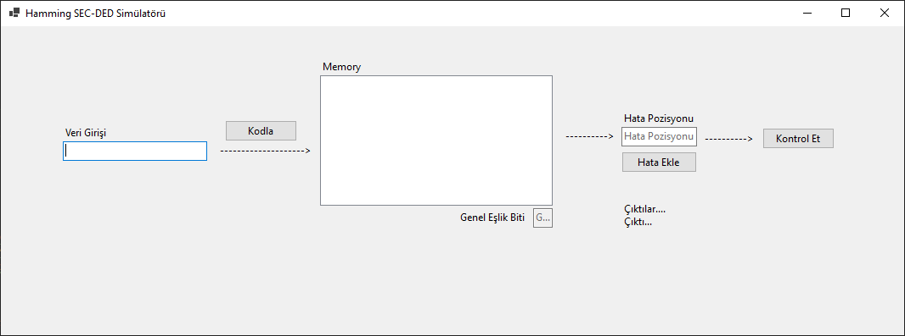
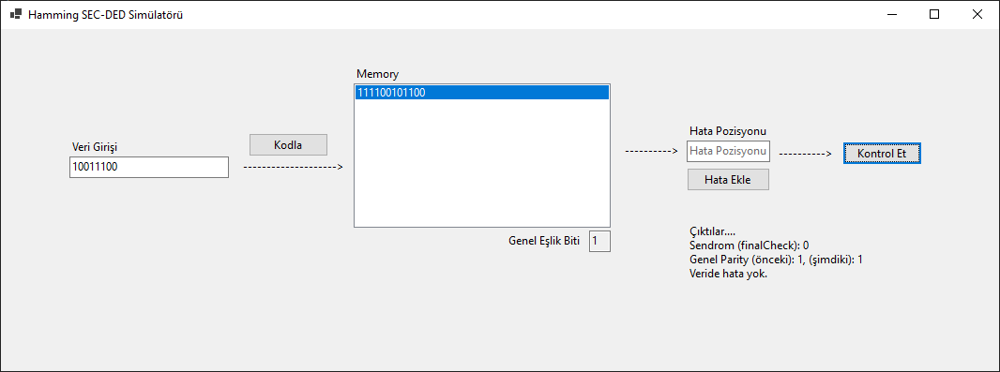
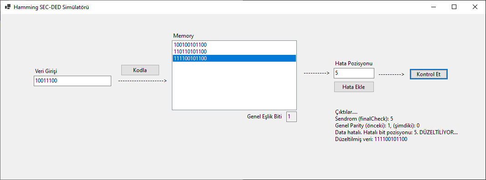
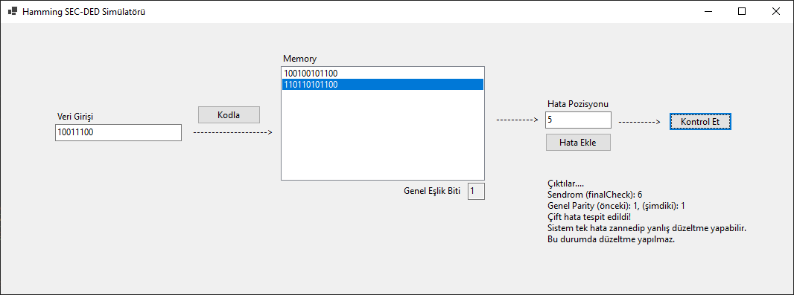

# 🛠 Hamming SEC-DED Simülatörü

## 🔍 Proje Hakkında

Bu proje, **C# Windows Forms** kullanılarak geliştirilmiş bir **Hamming Kodlama (SEC-DED)** simülatörüdür. Kullanıcı dostu bir arayüz ile 8, 16 veya 32 bitlik ikili verilerin Hamming kodlarıyla kodlanması, yapay hatalarla bozulması ve tek/çift hata tespiti ile otomatik düzeltilmesi sağlanmaktadır.

## 🎯 Amaç ve Hedefler

- Hamming (SEC-DED) algoritmasını görsel ve etkileşimli olarak simüle etmek
- Eğitim ve test amaçlı hata senaryoları oluşturmak
- Tek hata düzeltme ve çift hata tespiti (Single Error Correction - Double Error Detection) mantığını kullanıcıya göstermek

## 🖥 Özellikler

- 8 / 16 / 32 bitlik veri girişi desteği
- Hamming kodu üretimi (otomatik parity bit hesaplaması)
- Yapay hata ekleme (istenilen bit pozisyonunda)
- Hata kontrolü ve düzeltme
- Genel Parity biti kontrolü (çift hata tespiti için)
- Bellek listesiyle geçmiş verileri saklama

---

## 🎬 Demo Videosu

Aşağıdaki video, Hamming SEC-DED Simülatörü'nün kullanımını adım adım göstermektedir:

📺 **YouTube Linki:** [Demo Videosu Linki](https://www.youtube.com/watch?v=O7tjxgZpcEg)

---

## 📷 Arayüzden Görünüm

 <!-- Varsa ekran görüntüsü linki ekleyin -->

---

## 🚀 Kullanım

### 1. Uygulamayı Başlatma
Proje `Windows Forms` uygulaması olarak çalışır. Aşağıdaki dosya üzerinden derlenip çalıştırılır:

```bash
WinFormsApp1.sln
```

---

## 📥 Kullanım Adımları

### 1. Veri Girişi
- `0` ve `1` karakterlerinden oluşan **8, 16 veya 32 bitlik** bir ikili veri girin.
- **“Kodla”** butonuna tıklayarak veri Hamming koduna dönüştürülür ve belleğe eklenir.

### 2. Hata Ekleme
- Bellekten bir veri seçin.
- Hatalı olmasını istediğiniz **bit pozisyonunu** girin.
- **“Hata Ekle”** butonuna tıklayarak ilgili biti tersleyin (0 → 1, 1 → 0).

### 3. Hata Kontrolü
- Bellekten bir veriyi seçin.
- **“Kontrol Et”** butonuna basıldığında:
  - ✅ **Hata yoksa**: Bilgi verilir.
  
  - 🔁 **Tek hata varsa**: Otomatik olarak düzeltilir. (Parity bitinde hata varsa Data bitleri doğru olduğu için düzeltmez)
  
  - ❌ **Çift hata varsa**: Uyarı verilir, **düzeltme yapılmaz**.
  

---

## 🧪 Örnek Kullanım Akışı

| Adım         | Açıklama                                  |
|--------------|--------------------------------------------|
| **Giriş**     | `11010101`                                |
| **Kodlama**   | `011100101101011` → Hamming kodu üretilir |
| **Hata**      | 6. bit terslenir (`0` ↔ `1`)              |
| **Kontrol**   | 6. pozisyon hatalı bulunur → düzeltme yapılır |
| **Genel Parity** | Parity biti farklıysa → çift hata tespit edilir, düzeltme yapılmaz |

---


